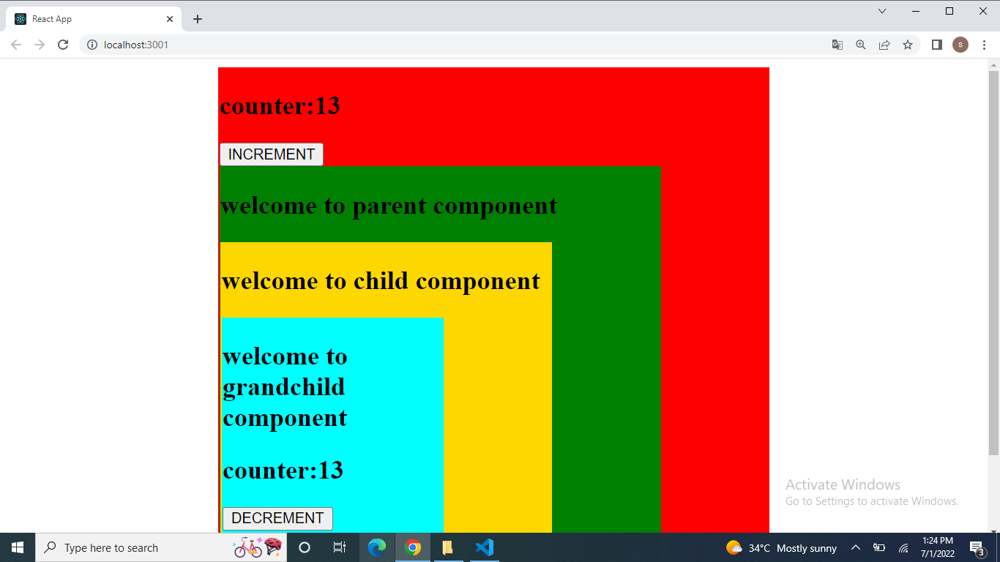

<h2>REDUX IN REACT JS:</h2>
<hr>
<h3>Installation:</h3><br>
1.npx create-react-app(create the react application)<br>
2.npm install redux(add the redux packages in react)<br>
3.npm install react-redux(it is used to get the {Provider})<br>
<hr>
<h3>REDUX:</h3><br>
1.Redux is an opensource js library for creating webpage.<br>
2.Redux is an statemanagement tool.<br>
3.If you get the data from serverside it is very easy to manage and also distribute using Redux.<br>
4.Redux is also used to avoid the prop drilling.<br>
<hr>
<h3>STRUCTURE:</h3><br>
.Action(in which operation user wants to be performed (read,delete,update))<br>
.Reducer<br>
.Store<br>
.Dispatch (it is execute the action)<br>

 <hr>
 ```
 ACTION:
 index.js
 //User can perform this action increment or decrement
export const increment = () => {
    return {
        type: "increment"
    }
}

export const decrement = () => {
    return {
        type: "decrement"
    }
}

```
<hr>

```
Parent.js(nested component)
import Child from "../Child/Child ";
import './Parent.css';
function Parent() {
     return (
          <div class="parent">
               <p>welcome to parent component</p>
                 <Child></Child>
          </div>
     )}
export default Parent;

```
<hr>

```
child.js
import Grandchild from "../Grandchild/Grandchild";
import './Child.css';
function Child() {
    return (
        <div class="child">
            <p>welcome to child component</p>
            <Grandchild></Grandchild>
        </div>
    )}
export default Child;

```
<hr>

```
Grandchild.js
import { useDispatch, useSelector } from 'react-redux';
import { decrement } from '../Action';
import './Grandchild.css';
function Grandchild() {
     //we can access the store(state)in the component using useSelector method.
     const count = useSelector((state) => state.counter)
      //This is where we actually execute the action.
    const dispatch = useDispatch()
     return (
          <div class="grandchild">
               <p>welcome to grandchild component</p>
               counter:{count}
               <button onClick={() => dispatch(decrement())}>DECREMENT</button>
          </div>
     )}
export default Grandchild;

```
<hr>
<h2>Screenshot:</h2>
